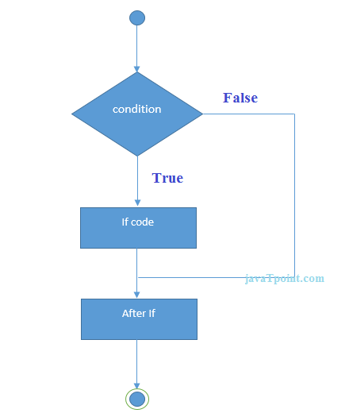

# Что такое Java-скрипт?

-------------------------------------------
### <code style="color : green">JavaScript</code> — популярное  программирование язык, обладающий широким спектром Приложения.

###  Иначе Java Script называют языком Интернета.
####     С помощью Java-Script мы можем сделать сайт живым

## Бредан Эйх создает самую первую версию Java-Script в 1995 всего за 10 дней. Она называется Mocha.
# ВЫПУСКИ ЯВАСКРИПТА
## Спецификация ECMAScript — это стандартизированная спецификация сценария. язык, разработанный Бренданом Эйхом из Netscape, первоначально назывался Mocha, затем LiveScript и, наконец, JavaScript.Изучите современный JavaScript с самого начала, но не забывая о старом.части!
# Запустить JavaScript

## Благодаря широкому спектру приложения, вы можете запускать JavaScript несколькими способами:
### • Использование вкладки консоли веб-браузеров.
### • Использование Node.js.
### • Создавая веб-страницы
# . Использование Node.js

## Node — это серверная среда для выполнения JavaScript.код. Чтобы запустить JS с использованием Node.js, выполните следующие действия:
### 1. Установите последнюю версию Node.js.
### 2. Open Visual studio code and create js file
### 3. Запустите узел, привет, ребята.
# Переменные и константы JavaScript
## В Javascript существует два типа инициализации переменных: var и let. Вы можете использовать оба из них.Однако между ними есть некоторые различия.В программировании переменная — это контейнер (область хранения) для хранения данных.Если вы уверены, что значение переменной не будет меняться на протяжении всей программы, рекомендуется использовать const.
 ## 1.Var
 ### var — используется в старых версиях Java-Script.
 ### var — область действия функции (будет обсуждаться в последующих руководствах)
 ### Например, var n;
 ## 2.Let 

### let — это новый способ объявления поддержки, начиная с ES6 (ES 2015).
### let имеет блочную область действия (будет обсуждаться в последующих руководствах).
### Например, пусть y;
## 3.Const

## Ключевое слово const указывает, что значение переменной является константой; и const это униуникальный
# Тип Java-скрипта

# Java Script имеет 8 типов
## Семь типов — переход к примитивным типам
### 1.Number
### 2.String 
### 3.Boolean
### 4.Underfined
### 5.Null
### 6.Symbol
### 7.BigInt
## И один из них переход к OBJECTS
### Это тип Object 
# Операторы в JavaScript
 
#  Три важные темы

## 1.CONDITIONS
## 2.LOOPS
## 3.FUNCTIONS

# 1.CONDITION If/else statement
  
 ### Оператор if-else в JavaScript используется для выполнения кода независимо от того, истинно или ложно условие. В JavaScript существует три формы оператора if.
 # CONDITION Ternary operator
   
  ### Тернарный оператор Java — это сокращенный способ написания оператора if-else, который возвращает одно значение. Его также называют условным оператором, поскольку он использует условие для определения возвращаемого значения.
  # CONDITION Switch statment
    
   ### Оператор переключения сначала оценивает свое выражение. Затем он ищет первое предложение case, выражение которого имеет то же значение, что и результат входного выражения (с использованием строгого сравнения на равенство), и передает управление этому предложению, выполняя все инструкции, следующие за этим предложением. 
   # LOOP for
 
### Оператор for создает цикл, состоящий из трех необязательных выражений, заключенных в круглые скобки и разделенных точкой с запятой, за которыми следует оператор (обычно оператор блока), который должен выполняться в цикле.
# FUNCTIONS 

### Функция JavaScript определяется ключевым словом function, за которым следует имя, за которым следуют круглые скобки ().
 # FUNCTION Declaration

### Объявление функции создает объект Function. Каждый раз, когда вызывается функция, она возвращает значение, указанное последним выполненным оператором возврата, или неопределенное, если достигнут конец тела функции. См. функции для получения подробной информации о функциях.
 # FUNCTION expression
 
 ### Выражение функции очень похоже на объявление функции и имеет почти тот же синтаксис. Основное различие между выражением функции и объявлением функции — это имя функции, которое можно опустить в выражениях функции для создания анонимных функций.
 # FUNCTION iife 
  
  ### Немедленно вызываемые функциональные выражения (IIFE) — это функции JavaScript, которые выполняются сразу после их определения. Обычно они используются для создания локальной области видимости для переменных, чтобы предотвратить их загрязнение глобальной области.

 

 

